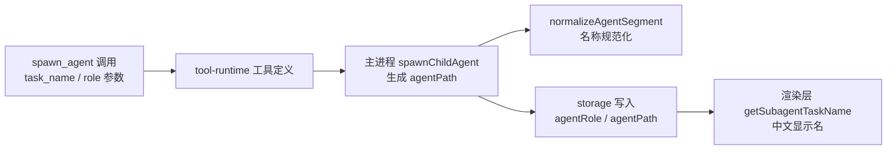

# Conversation Turn Context

- Turn run: `1fe4b255-871a-4065-b0ec-0a8c507f3184`
- Completed at: `2026-09-15T02:05:39.353Z`
- MCP sources: none

## User Request

我说的就是 把 这些替换成我刚才给的 名字， 之前配置代码已经还原 你只需要改  export const SUBAGENT_COURTESY_NAMES 即可

## Effective Task Context

Previous task that the current follow-up refers to:
如果我不配置 config.toml 里面的 namePool   子智能体 会是什么名字 从哪里取值？
Current follow-up request:
我说的就是 把 这些替换成我刚才给的 名字， 之前配置代码已经还原 你只需要改  export const SUBAGENT_COURTESY_NAMES 即可

## Assistant Result

名单已经换成你给的那 9 个名字，相关用例 32 个全部通过。

## 改动内容

只动了 `apps/desktop/src/renderer/cards/runtime-cards.tsx` 里的 `SUBAGENT_COURTESY_NAMES`：

```ts
export const SUBAGENT_COURTESY_NAMES = [
  "羲和", "常羲", "精卫", "烛龙", "英招", "陆吾", "鸾鸟", "毕方", "乘黄"
] as const;
```

顺带把 `courtesyNameAt` 的兜底值从写死的 `"竈門炭治郎"` 改成 `SUBAGENT_COURTESY_NAMES[0]`，这样名单再换也不会残留旧名字。

## 分配规则

按子智能体创建时间顺序依次取名：第 1 个是「羲和」，第 2 个「常羲」，依此类推。9 个用完进入第二轮，名字后面加序号——「羲和壱」「常羲壱」……到第十轮之后改用阿拉伯数字。

## 验证结果

| 检查项 | 结果 |
|---|---|
| 读回文件内容 | 9 个名字完整无乱码，旧日文名已无残留 |
| 单元测试 | `subagent-ui` 15 例 + `subagent-assignment` 8 例 + `multi-agent-storage` 9 例，共 32 例全部通过 |
| 改动范围 | 仅渲染层名单与兜底值，未触碰主进程命名逻辑 |

重启应用后生效。之前 `config.toml` 里的 `namePool` 已按你说的还原，现在命名完全由这份名单决定。

## Verified Sources And Deliverables

- `packages/tool-runtime/src/index.ts:2238`
- `packages/shared-types`
- `D:\workagent\apps\desktop\src\renderer\cards\runtime-cards.tsx`

---

# Conversation Turn Context

- Turn run: `59aa1dd4-31d9-4048-b222-376b72e77699`
- Completed at: `2026-09-14T01:23:29.862Z`
- MCP sources: none

## User Request

查一下 给子智能体命名的 代码写在哪里了？

## Effective Task Context

查一下 给子智能体命名的 代码写在哪里了？

## Assistant Result

找到了。给子智能体命名的代码分布在一条完整的链路上，从参数接收、名称生成到界面展示。

## 命名链路总览



### 1. 参数接收：`packages/tool-runtime/src/index.ts`（2210–2255 行）

`spawn_agent` 工具在这里注册，`task_name` 参数在第 2218 行声明，第 2238 行决定实际使用的角色名：

```ts
role: String(args.role ?? args.task_name ?? "implementer")
```

即优先用 `role`，其次 `task_name`，都没传则默认 `implementer`。

### 2. 名称生成：`apps/desktop/src/main/app.ts`（`spawnChildAgent`，4388–4462 行）

- 第 4426 行：`const role = normalizeAgentSegment(input.role)` 把名称清洗成可用作路径的片段。
- 第 4442–4448 行：生成唯一标识 `agentPath`，格式为 `父路径/角色名`，重名时自动加后缀 `role-2`、`role-3`。
- 第 4449–4461 行：调用 `createThread`，同时写入 `agentRole: input.role`（保留原始名称）和线程标题 `${input.role}: ${任务前40字}`。

### 3. 规范化规则：`apps/desktop/src/main/app.ts:5595`（`normalizeAgentSegment`）

小写化、非 `a-z0-9_-` 字符替换为 `-`、最长 48 字符，空值回退为 `agent`。所以中文 `task_name` 传到这里会变成 `-`，最终落到 `agent`。

### 4. 界面显示名：`apps/desktop/src/renderer/cards/runtime-cards.tsx`

这是中文卡片标题真正的来源，核心函数是第 247 行的 `getSubagentTaskName`，取名优先级为：

1. `agentRole` 本身（第 249 行，需通过 `looksLikeUnusableRole` 校验）；
2. 从任务描述 `lastTaskMessage` 提取（`extractAssignedTaskName`，第 223 行，匹配“负责/分析/检查/审查”等句式）；
3. 人设句压缩（`compactPersonaName`，第 201 行，去掉“你是一个”“子智能体”等修饰）；
4. 都失败则兜底显示“任务分析”。

另外第 253 行还有一组 `SUBAGENT_COURTESY_NAMES` 动漫角色名作为备用名池。

如果你是想改命名行为，改哪一层取决于目的：改系统内部路径标识就动 `normalizeAgentSegment`，改用户看到的中文标题就动 `runtime-cards.tsx` 的提取逻辑。

## Verified Sources And Deliverables

- none