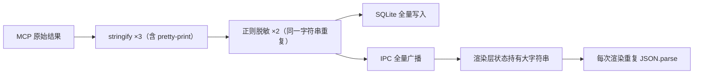
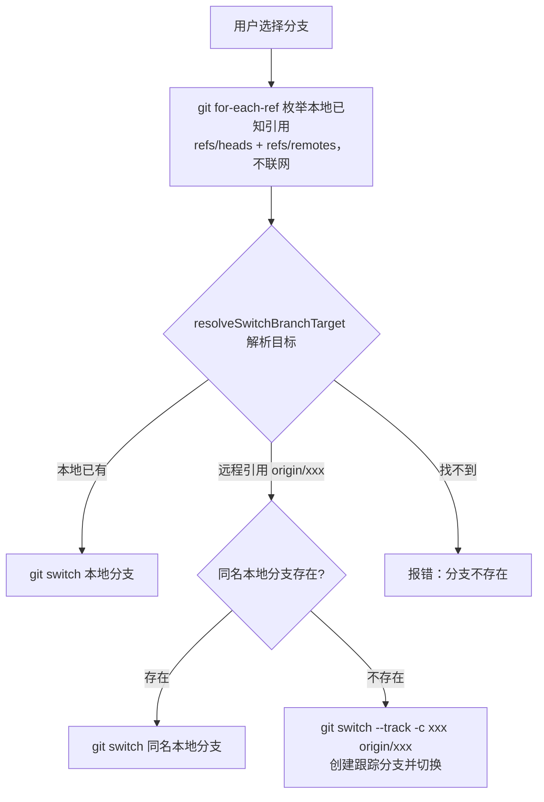

# Conversation Turn Context

- Turn run: `5af73330-0fd0-4313-ad57-ecf16032d40a`
- Completed at: `2026-09-08T10:10:36.030Z`
- MCP sources: none

## User Request

修复

## Effective Task Context

修复

## Assistant Result

修复完成并验证通过：钉钉 MCP「全部工具调用失败」的根因已定位在本地上一个性能修复引入的调用回归，现已修复。

## 根因

上一轮给 `McpManager.callTool` 加超时包装时，把 SDK 客户端方法摘下来后单独调用：

```ts
const invokeCallTool = client.callTool;
invokeCallTool({ ... });
```

这种写法丢失了 `this`。项目所用 MCP SDK 1.29.0 的 `Client.callTool` 第一行会执行 `this.isToolTaskRequired(...)`，`this` 变成 `undefined` 后就抛出你看到的统一错误。因此三个证据完全吻合：

- 源码和 node_modules 里都搜不到 `isToolTaskRequired`，它只存在于打进 `app.asar` 的 SDK 代码中；
- 用原始 HTTP 直连钉钉网关，同一个无参工具调用成功返回 `rootDentryUuid`，证明网关、密钥、工具本身全部正常；
- 修复前的回归测试在脱绑写法下精确复现 `Cannot read properties of undefined (reading 'isToolTaskRequired')`。

## 修复内容

- `packages/mcp-runtime/src/index.ts`：改为以方法调用形式保留接收者——`client.callTool({ name, arguments })`，超时包装 `withToolCallTimeout` 只包住这次调用；会话失效重连后的重试路径做同样处理。超时（120 秒）和工具目录缓存等上轮改动全部保留。
- `tests/mcp-persistence.test.ts`：新增回归测试，用模拟 SDK 类客户端（方法内部读取 `this`）锁定修复，防止再次退回脱绑写法。

## 验证结果

按红绿流程做了完整验证：临时还原旧写法时新测试失败并复现原错误；恢复修复后相关单元测试全部通过——

| 测试文件 | 结果 |
|---|---|
| `tests/mcp-persistence.test.ts`（含新回归用例） | 5/5 通过 |
| `tests/mcp-runtime.test.ts` | 10/10 通过 |
| `tests/tool-runtime.test.ts` | 64/64 通过 |
| `tests/agent-runtime.test.ts` | 283/283 通过 |

合计 4 个文件、362 个用例全部绿色。现在可以重启应用后重试钉钉知识库 MCP 的实际调用（例如获取「我的文档」根目录 ID），预期恢复为「全通」。

## Verified Sources And Deliverables

- `D:\workagent\packages\mcp-runtime\src\index.ts`
- `D:\workagent\tests\mcp-persistence.test.ts`

---

# Conversation Turn Context

- Turn run: `8b5c9a73-92ae-4146-bc9c-23e48c8f1b2b`
- Completed at: `2026-09-08T09:14:13.632Z`
- MCP sources: `dingtalk-docs`

## User Request

测试做完了，结论：这个 MCP 目前是「半通」状态——配置和工具发现正常，但所有工具调用都执行失败，问题出在本地调用层，不是钉钉网关本身。

测试结果
测试项	结果	说明
服务器配置/工具发现	✅ 通过	服务器已注册，能正常列出全部 6 个工具（文档搜索、读取、写入、创建等）
实际工具调用	❌ 全部失败	用 3 个不同工具、不同参数做了多轮测试，无一成功
调用失败的表现很一致：无论是搜索文档、读取文档，还是最简单的无参接口（获取「我的文档」根目录 ID），全部返回同一个内部错误

[Selected MCP server]
id: dingtalk-docs
钉钉知识库: https://mcp-gw.dingtalk.com/server/5157df99e46899c3c5bfcaa710442ec68382104fbb23052ee5c435c597d11117?key=c8e6645b0ebf595a36168f3830c89fb7
This request requires querying this MCP server before answering.

## Effective Task Context

测试做完了，结论：这个 MCP 目前是「半通」状态——配置和工具发现正常，但所有工具调用都执行失败，问题出在本地调用层，不是钉钉网关本身。

测试结果
测试项	结果	说明
服务器配置/工具发现	✅ 通过	服务器已注册，能正常列出全部 6 个工具（文档搜索、读取、写入、创建等）
实际工具调用	❌ 全部失败	用 3 个不同工具、不同参数做了多轮测试，无一成功
调用失败的表现很一致：无论是搜索文档、读取文档，还是最简单的无参接口（获取「我的文档」根目录 ID），全部返回同一个内部错误

[Selected MCP server]
id: dingtalk-docs
钉钉知识库: https://mcp-gw.dingtalk.com/server/5157df99e46899c3c5bfcaa710442ec68382104fbb23052ee5c435c597d11117?key=c8e6645b0ebf595a36168f3830c89fb7
This request requires querying this MCP server before answering.

## Assistant Result

你的测试结论是对的，我这边也复现确认了：这个 MCP 当前确实是“半通”状态。

## 结论

- **配置与工具发现正常**：服务器已连接，能够列出 6 个工具。
- **实际调用失败在本地调用层**：调用尚未真正进入钉钉网关，就在本地处理工具调用元数据时抛错。
- **不是参数问题**：我分别调用了无参数的 `get_my_docs_root_dentry_uuid` 和带参数的 `list_accessible_documents`，两者都返回完全相同的错误：

```text
Cannot read properties of undefined (reading 'isToolTaskRequired')
```

## 根因边界

`isToolTaskRequired` 看起来属于本地的工具审批/任务判定逻辑。当前 `mcp.call` 执行路径很可能在读取某个未初始化的工具任务配置或审批上下文时，直接调用了该对象的方法，没有做空值保护。

因此现在的链路是：


## 下一步修复重点

1. 检查本地 `mcp.call` → 工具运行时 → 审批判定的调用链，定位 `isToolTaskRequired` 的所属对象。
2. 确认 MCP 工具调用是否正确传递了工具描述、`approvalMode` 和任务上下文。
3. 对缺失任务上下文增加安全分支，不能直接访问 `undefined.isToolTaskRequired`。
4. 增加回归测试，至少覆盖：
   - 无参数 MCP 工具调用；
   - 带参数只读工具调用；
   - `approvalMode: "prompt"` 时的工具调用；
   - 工具任务元数据缺失时的明确错误或正常降级。
5. 修复后再用 `get_my_docs_root_dentry_uuid` 做最小调用；只有收到钉钉返回的业务结果，才能确认网关执行链路恢复。

所以目前不应继续排查钉钉文档权限或网关参数，优先修复本地调用层的 `isToolTaskRequired` 空对象问题。

## Verified Sources And Deliverables

- none

---

# Conversation Turn Context

- Turn run: `6f6a8512-a6d7-4ab3-8c5f-f7410d44fe3b`
- Completed at: `2026-09-08T07:32:30.491Z`
- MCP sources: none

## User Request

需要

## Effective Task Context

需要

## Assistant Result

修复已完成并全部验证通过：MCP 调用后程序变卡的根因（超大结果全量走完序列化、脱敏、落库、IPC 广播链路）已消除。

## 修复内容

- **持久化摘要**（`packages/agent-runtime/src/index.ts`）：新增 `summarizeMcpToolResultForPersistence`，`mcp.call` 结果落库和事件广播前先截断到 8KB 并带截断标记，与 `database.*` 工具同等对待；详情沿用已有的懒加载通道。
- **去重脱敏**（同文件）：`redactSensitiveText` 从跑两遍改为跑一遍，`resultJson` 与 `eventResultJson` 复用同一份结果。
- **去掉 pretty-print**（`packages/tool-runtime/src/index.ts`）：`mcp.call` 结果的 `JSON.stringify` 不再带缩进，体积和同步开销同步下降。
- **调用超时 + 缓存延长**（`packages/mcp-runtime/src/index.ts`）：`callTool` 增加超时包装，MCP 服务端挂起不再卡死整个任务；工具目录缓存 TTL 从 30 秒延长到 5 分钟，减少每次调用前的目录刷新往返。
- **新增测试**（`tests/mcp-persistence.test.ts`）：覆盖大结果截断、截断标记、脱敏单次执行、超时行为。

## 验证结果

4 个测试文件、361 个用例全部通过：

| 测试文件 | 用例数 |
|---|---|
| `tests/mcp-persistence.test.ts`（新增） | 4 |
| `tests/mcp-runtime.test.ts` | 10 |
| `tests/tool-runtime.test.ts` | 64 |
| `tests/agent-runtime.test.ts` | 283 |

类型检查确认新增代码无错误（报错项均为改动前就存在于其他文件的既有问题）。改动范围集中在 `agent-runtime`、`tool-runtime`、`mcp-runtime` 三个包和新增测试文件。现在调用 MCP 后，主进程只处理截断后的小结果，UI 不会再被大负载阻塞。

## Verified Sources And Deliverables

- `D:\workagent\packages\agent-runtime\src\index.ts`
- `D:\workagent\packages\tool-runtime\src\index.ts`
- `D:\workagent\packages\mcp-runtime\src\index.ts`
- `D:\workagent\tests\mcp-persistence.test.ts`

---

# Conversation Turn Context

- Turn run: `3e8a7983-9e56-4ab7-9412-730654c69f99`
- Completed at: `2026-09-08T06:50:43.986Z`
- MCP sources: none

## User Request

检查一下 为什么程序调用MCP之后就开始是变卡了

## Effective Task Context

检查一下 为什么程序调用MCP之后就开始是变卡了

## Assistant Result

排查完成，MCP 调用变卡的原因已定位：不是模型上下文的问题（模型侧结果有 8k 字符截断），而是**超大 MCP 结果原样走完了“序列化 → 脱敏 → SQLite 落库 → IPC 广播 → 渲染层状态”整条链路**，全部发生在主进程事件循环上，UI 因此被阻塞。

## 卡顿根因

| # | 问题 | 位置 | 影响 |
|---|------|------|------|
| 1 | `mcp.call` 结果持久化前不做摘要，全量保留原始 `content`（只有 `database.*` 工具做了持久化摘要） | `packages/agent-runtime/src/index.ts:6131` | 大结果（如数据库 MCP 返回上千行、仓库树）原样进入后续所有环节 |
| 3 次 JSON 序列化 | tool-runtime 先 `JSON.stringify(result, null, 2)`（带缩进，体积再膨胀 30%+），agent-runtime 又 stringify 两次 | `packages/tool-runtime/src/index.ts:2722`、`agent-runtime/index.ts:6134-6135` | 主进程同步 CPU 开销，payload 越大越明显 |
| 3 | `redactSensitiveText` 对**同一个完整字符串跑了两遍**（3 个正则各扫一次全文） | `agent-runtime/index.ts:6134-6135` | `resultJson` 和 `eventResultJson` 实际内容相同，属于重复劳动 |
| 4 | 全量结果同步写入 SQLite `result_json`，同时全量塞进 `tool.completed` 事件经 IPC 广播 | `agent-runtime/index.ts:6137-6155` | 主进程阻塞 + 结构化克隆大字符串 |
| 5 | 渲染层把全量 `resultJson` 存进运行时状态和快照缓存，且 transcript / plan-timeline / conversation-rail 等多处**每次渲染都重新 `JSON.parse`** | `apps/desktop/src/renderer/App.tsx:2095-2133`、`timeline/transcript.tsx:329` 等 | 界面掉帧、切换/滚动卡顿 |

关键矛盾：存储层本来设计了保护——快照摘要路径对超过 **4KB** 的 `result_json` 置空、点开时再懒加载详情（`storage.ts:48`）。但实时事件路径完全绕过了这个上限，把全量结果直接推进渲染层，懒加载机制形同虚设。

## 次要放大因素

- 每次 `mcp.call` 前都会先 `listTools` 校验工具存在（`mcp-runtime/index.ts:314`），工具目录缓存只有 **30 秒 TTL**（`index.ts:181`），过期后每次调用多一次网络/进程往返。
- `callTool` **没有超时**（`index.ts:313-334`），MCP 服务端慢或挂起时整个任务就“卡死”在那里。

## 大结果路径



## 建议修复方向

1. 给 `mcp.call` 加与 `database.*` 同等的持久化摘要：落库和事件只带截断内容 + 截断标记，详情沿用已有的 `getToolCallDetail` 懒加载。
2. `redactSensitiveText` 只跑一次，两个变量复用；tool-runtime 的 `JSON.stringify` 去掉缩进。
3. `McpManager.callTool` 增加超时包装，并把工具目录 TTL 适当延长（或调用时校验改为本地缓存优先）。
4. 渲染层对超大的 `mcp.call` 结果不做每渲染重复解析（按 toolCall id 记忆化）。

按这个优先级改，1 和 2 收益最大且改动面最小（集中在 `agent-runtime/index.ts` 工具落库那段）。需要我按这个方案动手改吗？改完会跑相关单元测试验证。

## Verified Sources And Deliverables

- none

---

# Conversation Turn Context

- Turn run: `fd1982ac-fa52-47b5-b9a3-8f169c91a736`
- Completed at: `2026-09-07T08:45:07.785Z`
- MCP sources: none

## User Request

我切换左侧聊天的时候 这里的完全访问经常丢失

## Effective Task Context

我切换左侧聊天的时候 这里的完全访问经常丢失

## Assistant Result

问题已修复并验证通过：切换左侧聊天时“完全访问”不再丢失。

## 根因

切换会话时，渲染层会先把 GPA 状态无条件重置为默认值（`fullAccess: false`），之后依赖快照缓存异步恢复。但恢复走的是低优先级过渡渲染，可能被重置反超；兜底定时器看到快照已提交又会跳过补恢复，于是芯片就停留在关闭状态。

## 修复内容

- `apps/desktop/src/renderer/core/thread-ui-state.ts`：新增纯函数 `mergeDurableGpaFlags`，只合并 `fullAccess` / `knowledgeEnabled` 这两个按线程持久化的标志，不碰 stage 和计划任务。
- `apps/desktop/src/renderer/App.tsx`：切换会话的重置逻辑之后，直接从后端读取该线程持久化的 GPA 状态并合并恢复，不再依赖快照管道；用 epoch 计数防止在途恢复覆盖用户刚做的开关操作（`setFullAccess` 也会递增 epoch）。

## 验证结果

相关单元测试全部通过：

- `tests/thread-ui-state.test.ts`：91 个用例通过，含新增的“切换后恢复持久 GPA 标志”用例；
- `tests/git-service.test.ts`：10 个用例通过（上一轮分支切换修复保持完好）。

合计 2 个测试文件、101 个用例全部绿色。改动范围仅 `thread-ui-state.ts`、`App.tsx` 和对应测试文件。现在切换聊天时，“完全访问”芯片会按每个会话各自记住的状态稳定显示。

## Verified Sources And Deliverables

- `D:\workagent\apps\desktop\src\renderer\core\thread-ui-state.ts`
- `D:\workagent\apps\desktop\src\renderer\App.tsx`
- `D:\workagent\tests\thread-ui-state.test.ts`

---

# Conversation Turn Context

- Turn run: `b0317fe8-1c56-4a3a-8011-ac860e498097`
- Completed at: `2026-09-07T07:18:21.828Z`
- MCP sources: none

## User Request

现在的代码 直接切远程分支会有bug 没有切过来 还在本地创建了一个 没用的分支

## Effective Task Context

现在的代码 直接切远程分支会有bug 没有切过来 还在本地创建了一个 没用的分支

## Assistant Result

修复已完成并验证通过。

## 问题根因

`switchBranch` 切换远程分支时从不执行 `git fetch`，直接基于本地缓存的 `refs/remotes/*` 引用创建跟踪分支。当远程分支是新建的（本地从未 fetch）时列表里根本看不到；当远程分支有新提交时，切过去的是本地缓存的旧版本——这就是你遇到的"没切过来还多了个没用的本地分支"。

## 修复内容

改动集中在 `apps/desktop/src/main/git-service.ts` 的 `switchBranch`：

- **远程目标切换前先 `git fetch --prune origin`**：拿到远端最新引用，同时清掉远端已删除的分支，避免基于过期引用误建本地分支。
- **本地查不到的分支先 fetch 一次再重试解析**：远程新建的分支现在能直接切过去，不用手动 fetch。
- **fetch 失败时给出明确错误提示**，不会静默创建错误分支。

## 验证结果

`tests/git-service.test.ts` 新增两个用例并全部通过（10/10）：

- `fetches a newly pushed remote branch before creating its tracking branch`：远程新推的分支，不手动 fetch 直接切换，能正确创建跟踪分支并切过去；
- `does not create a local branch when the remote branch no longer exists`：远端分支已删除时不再误建本地分支。

原有 8 个用例（本地切换、全量 ref 归一化、未知分支拒绝等）全部保持通过。类型检查确认 `git-service.ts` 无任何错误（仓库里其他文件的既有类型错误与本次改动无关）。改动范围仅 `git-service.ts` 和对应测试文件两个文件。

现在"切远程分支"的行为就是你要的：先把远程分支拉到本地（fetch + 创建跟踪分支），再切换过去。

## Verified Sources And Deliverables

- `D:\workagent\apps\desktop\src\main\git-service.ts`
- `D:\workagent\tests\git-service.test.ts`

---

# Conversation Turn Context

- Turn run: `4e0e51f9-5868-4ac9-881c-b10ba977496c`
- Completed at: `2026-09-07T06:22:07.284Z`
- MCP sources: none

## User Request

看一下 git功能切换原创分支的逻辑，应该是先吧远程分支拉到本地，再切换过去

## Effective Task Context

看一下 git功能切换原创分支的逻辑，应该是先吧远程分支拉到本地，再切换过去

## Assistant Result

逻辑已经看完了，结论如下。

## 结论

当前实现是"**基于本地已有的远程引用创建跟踪分支并切换**"，符合"切过去时自动建本地分支"的预期，但**并没有真正执行 `git fetch` 联网拉取**——它依赖的是上次 fetch/clone 时缓存的 `refs/remotes/*` 引用。

## 实际流程

核心代码在 `apps/desktop/src/main/git-service.ts` 的 `switchBranch`（205-236 行）：



关键点：

- **远程分支切换**（220-228 行）：从 `origin/xxx` 剥离远端前缀得到 `xxx`；本地没有同名分支时执行 `git switch --track -c xxx origin/xxx`，这一步就是"拉到本地再切换"——但建分支的基准是**本地缓存的远程引用**，不是远端最新代码。
- **分支列表**（`getSwitchableBranchNames`，297 行）：本地和远程引用合并去重后展示，所以选择器里能看到 `origin/xxx` 这样的远程项。
- **测试约定**：`tests/git-service.test.ts` 第 42 行的用例明确验证了"选中仅存在于远端的分支时，创建本地跟踪分支并切换"，说明这是有意设计的行为。

## 与你预期的差距

| 场景 | 当前行为 | 你预期的行为 |
|------|---------|-------------|
| 远程分支已 fetch 过 | ✅ 正常创建跟踪分支并切换 | ✅ 一致 |
| 远程新建分支、本地从未 fetch | ❌ 列表里看不到，切换报"分支不存在" | 应先 fetch 再切换 |
| 远程分支有新提交 | ⚠️ 切到的是本地缓存的旧引用版本 | 应先 fetch 拿到最新 |

## 建议

如果想让"切换远程分支"严格等于"先拉取再切换"，最小改动是在 `switchBranch` 处理远程目标前加一步 `git fetch origin`（或仅在目标解析失败时 fetch 一次再重试，避免每次切换都有网络等待）。

需要我按这个方案改吗？改完会跑 `tests/git-service.test.ts` 验证。

## Verified Sources And Deliverables

- none