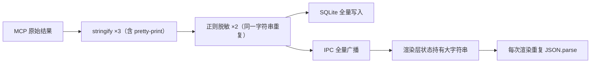

# Conversation Turn Context

- Turn run: `3e8a7983-9e56-4ab7-9412-730654c69f99`
- Completed at: `2026-09-08T06:50:43.986Z`
- MCP sources: none

## User Request

检查一下 为什么程序调用MCP之后就开始是变卡了

## Effective Task Context

检查一下 为什么程序调用MCP之后就开始是变卡了

## Assistant Result

排查完成，MCP 调用变卡的原因已定位：不是模型上下文的问题（模型侧结果有 8k 字符截断），而是**超大 MCP 结果原样走完了“序列化 → 脱敏 → SQLite 落库 → IPC 广播 → 渲染层状态”整条链路**，全部发生在主进程事件循环上，UI 因此被阻塞。

## 卡顿根因

| # | 问题 | 位置 | 影响 |
|---|------|------|------|
| 1 | `mcp.call` 结果持久化前不做摘要，全量保留原始 `content`（只有 `database.*` 工具做了持久化摘要） | `packages/agent-runtime/src/index.ts:6131` | 大结果（如数据库 MCP 返回上千行、仓库树）原样进入后续所有环节 |
| 3 次 JSON 序列化 | tool-runtime 先 `JSON.stringify(result, null, 2)`（带缩进，体积再膨胀 30%+），agent-runtime 又 stringify 两次 | `packages/tool-runtime/src/index.ts:2722`、`agent-runtime/index.ts:6134-6135` | 主进程同步 CPU 开销，payload 越大越明显 |
| 3 | `redactSensitiveText` 对**同一个完整字符串跑了两遍**（3 个正则各扫一次全文） | `agent-runtime/index.ts:6134-6135` | `resultJson` 和 `eventResultJson` 实际内容相同，属于重复劳动 |
| 4 | 全量结果同步写入 SQLite `result_json`，同时全量塞进 `tool.completed` 事件经 IPC 广播 | `agent-runtime/index.ts:6137-6155` | 主进程阻塞 + 结构化克隆大字符串 |
| 5 | 渲染层把全量 `resultJson` 存进运行时状态和快照缓存，且 transcript / plan-timeline / conversation-rail 等多处**每次渲染都重新 `JSON.parse`** | `apps/desktop/src/renderer/App.tsx:2095-2133`、`timeline/transcript.tsx:329` 等 | 界面掉帧、切换/滚动卡顿 |

关键矛盾：存储层本来设计了保护——快照摘要路径对超过 **4KB** 的 `result_json` 置空、点开时再懒加载详情（`storage.ts:48`）。但实时事件路径完全绕过了这个上限，把全量结果直接推进渲染层，懒加载机制形同虚设。

## 次要放大因素

- 每次 `mcp.call` 前都会先 `listTools` 校验工具存在（`mcp-runtime/index.ts:314`），工具目录缓存只有 **30 秒 TTL**（`index.ts:181`），过期后每次调用多一次网络/进程往返。
- `callTool` **没有超时**（`index.ts:313-334`），MCP 服务端慢或挂起时整个任务就“卡死”在那里。

## 大结果路径

## 建议修复方向

1. 给 `mcp.call` 加与 `database.*` 同等的持久化摘要：落库和事件只带截断内容 + 截断标记，详情沿用已有的 `getToolCallDetail` 懒加载。
2. `redactSensitiveText` 只跑一次，两个变量复用；tool-runtime 的 `JSON.stringify` 去掉缩进。
3. `McpManager.callTool` 增加超时包装，并把工具目录 TTL 适当延长（或调用时校验改为本地缓存优先）。
4. 渲染层对超大的 `mcp.call` 结果不做每渲染重复解析（按 toolCall id 记忆化）。

按这个优先级改，1 和 2 收益最大且改动面最小（集中在 `agent-runtime/index.ts` 工具落库那段）。需要我按这个方案动手改吗？改完会跑相关单元测试验证。

## Verified Sources And Deliverables

- none
