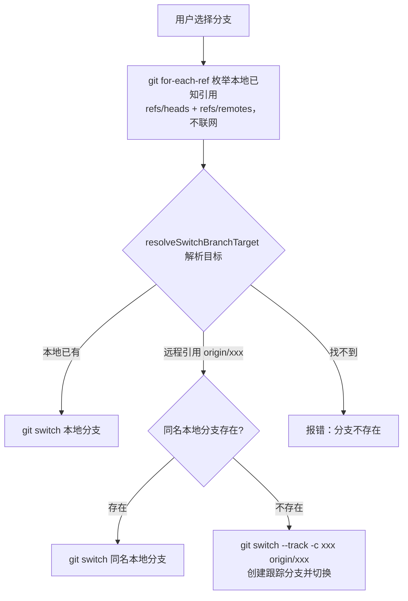

# Conversation Turn Context

- Turn run: `4e0e51f9-5868-4ac9-881c-b10ba977496c`
- Completed at: `2026-09-07T06:22:07.284Z`
- MCP sources: none

## User Request

看一下 git功能切换原创分支的逻辑，应该是先吧远程分支拉到本地，再切换过去

## Effective Task Context

看一下 git功能切换原创分支的逻辑，应该是先吧远程分支拉到本地，再切换过去

## Assistant Result

逻辑已经看完了，结论如下。

## 结论

当前实现是"**基于本地已有的远程引用创建跟踪分支并切换**"，符合"切过去时自动建本地分支"的预期，但**并没有真正执行 `git fetch` 联网拉取**——它依赖的是上次 fetch/clone 时缓存的 `refs/remotes/*` 引用。

## 实际流程

核心代码在 `apps/desktop/src/main/git-service.ts` 的 `switchBranch`（205-236 行）：

关键点：

- **远程分支切换**（220-228 行）：从 `origin/xxx` 剥离远端前缀得到 `xxx`；本地没有同名分支时执行 `git switch --track -c xxx origin/xxx`，这一步就是"拉到本地再切换"——但建分支的基准是**本地缓存的远程引用**，不是远端最新代码。
- **分支列表**（`getSwitchableBranchNames`，297 行）：本地和远程引用合并去重后展示，所以选择器里能看到 `origin/xxx` 这样的远程项。
- **测试约定**：`tests/git-service.test.ts` 第 42 行的用例明确验证了"选中仅存在于远端的分支时，创建本地跟踪分支并切换"，说明这是有意设计的行为。

## 与你预期的差距

| 场景 | 当前行为 | 你预期的行为 |
|------|---------|-------------|
| 远程分支已 fetch 过 | ✅ 正常创建跟踪分支并切换 | ✅ 一致 |
| 远程新建分支、本地从未 fetch | ❌ 列表里看不到，切换报"分支不存在" | 应先 fetch 再切换 |
| 远程分支有新提交 | ⚠️ 切到的是本地缓存的旧引用版本 | 应先 fetch 拿到最新 |

## 建议

如果想让"切换远程分支"严格等于"先拉取再切换"，最小改动是在 `switchBranch` 处理远程目标前加一步 `git fetch origin`（或仅在目标解析失败时 fetch 一次再重试，避免每次切换都有网络等待）。

需要我按这个方案改吗？改完会跑 `tests/git-service.test.ts` 验证。

## Verified Sources And Deliverables

- none
