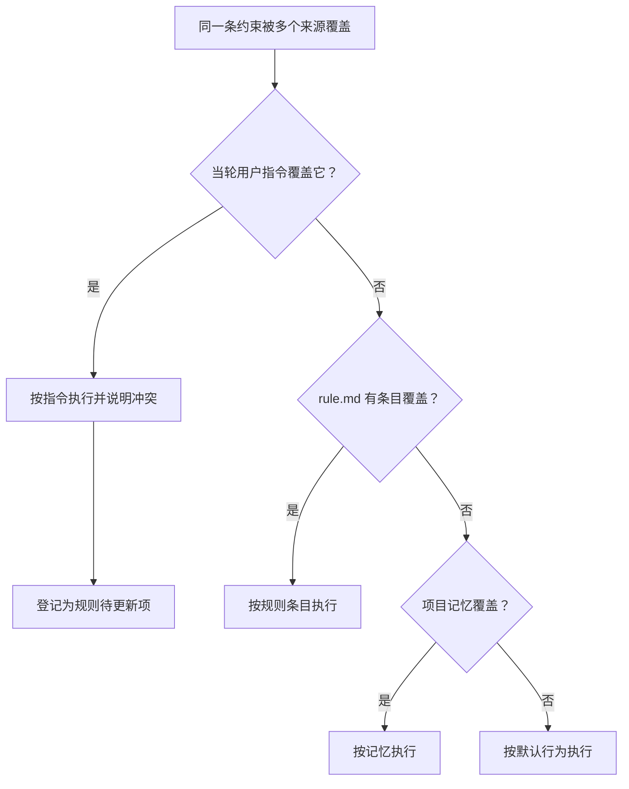

# 项目规则优先序

适用场景：项目级对话。本文定义 `.codexh/rule.md` 与计划文件（`.codexh/gpa-plan.md`）、项目记忆、系统默认行为之间的先后关系与冲突处理方式。

## 优先序

同一条约束被多个来源覆盖时，按下表从高到低取用。

| 名次 | 来源 | 生效条件 | 冲突处理 |
| --- | --- | --- | --- |
| 1 | 当轮用户指令 | 始终最高 | 命中规则条目冲突时按指令执行，并在回复中说明该冲突，同时把冲突登记为规则待更新项 |
| 2 | 项目规则 `.codexh/rule.md` | 无当轮指令冲突时 | 高于项目记忆与默认行为；改文件前先核对命中条目 |
| 3 | 项目记忆 | 与规则不冲突时 | 与规则冲突时以规则为准 |
| 4 | 默认行为与工具惯例 | 以上来源都未覆盖时 | 兜底行为 |

代码定义位置：`packages/agent-runtime/src/project-rule-precedence.ts`，导出 `PROJECT_RULE_PRECEDENCE`（分级与 rank）与 `PROJECT_RULE_PRECEDENCE_STATEMENT`（一句话声明）。该声明会被拼进每轮的规则注入块，因此优先序对模型可见、可核对。



## 元数据写入所有权

`.codexh` 下每个文件只有一个写入方，规则机制只写 `.codexh/rule.md`。

| 路径 | 写入方 | 规则机制是否可写 |
| --- | --- | --- |
| `.codexh/rule.md` | 规则机制（缺失生成、增量更新、自然语言改写） | 是，仅此一个 |
| `.codexh/gpa-plan.md` | GPA 计划流程 | 否；尤其不得改写 `completed_task_ids` |
| `.codexh` 下其他文件（记忆、扫描产物） | 各自写入方 | 否 |

落到代码上，写类工具（`apply_patch`、`fs.write_file`、`search_replace`）的目标若位于 `.codexh` 且不是 `rule.md`，写入前核对会以 `block` 级别拦截并登记冲突，避免规则更新污染计划进度或项目记忆。

## 验证方式

`tests/project-rule-precedence.test.ts` 覆盖四点：优先序次序与 rank 唯一、注入块包含优先序声明、计划文件写入被拦截而 `rule.md` 放行、连续两次规则更新后 `gpa-plan.md` 内容字节不变。

```powershell
npx vitest run tests/project-rule-precedence.test.ts
```
